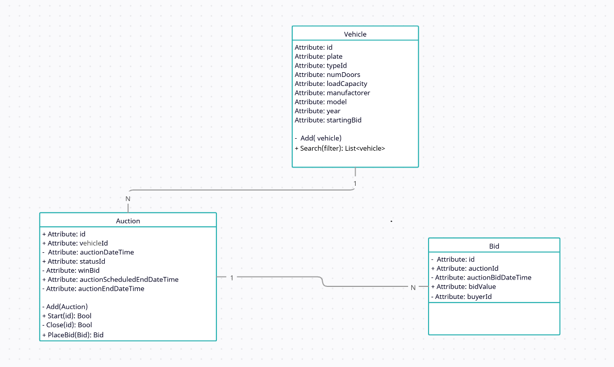
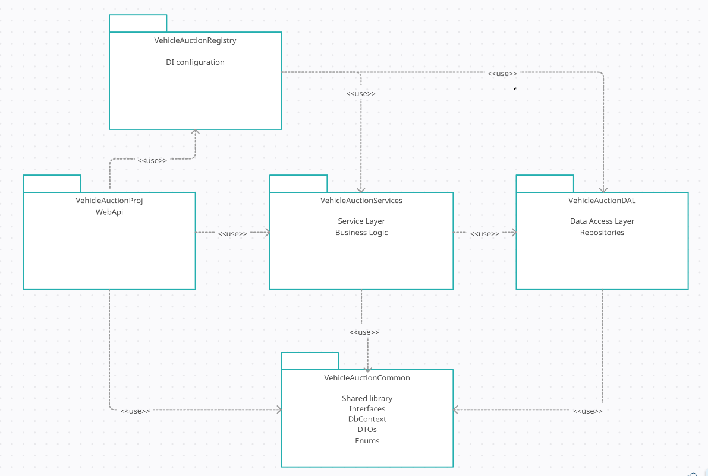

# VehicleAuctionProj

<a href="support/Problem_Statement.pdf">
Problem statement: Car Auction Management System
</a>

# Execution plan
Run/execute project **VehicleAuctionProj**, it will open a swagger page to help verify the features.

# Development Notes
- I assumed that we will have a single DTO for entity, and remove or rewrite any property accordingly to the logic.
- To see the classes diagram and System Architecure please scroll down to see the images.
- I selected a InMemory DB to help reduce the need to have external databases. But If you want examples I can implement them.
- InMemory DBs does not allow transactions but I let the example code commented. <a href="https://codeopinion.com/testing-with-ef-core/">Info link<a>
- Included some comments in the code about some ways of thinking, future improvements and "my business logic".
- I decided to use several approches in the code or in the tests, mainlly to show different ways of code implementation.
- Tests were implemented with NUnit and Moq
- VehicleAuctionUnitTests prooject has 24 unit tests to service layer and repository layer.

# Classes Diagram

# System Architecture

